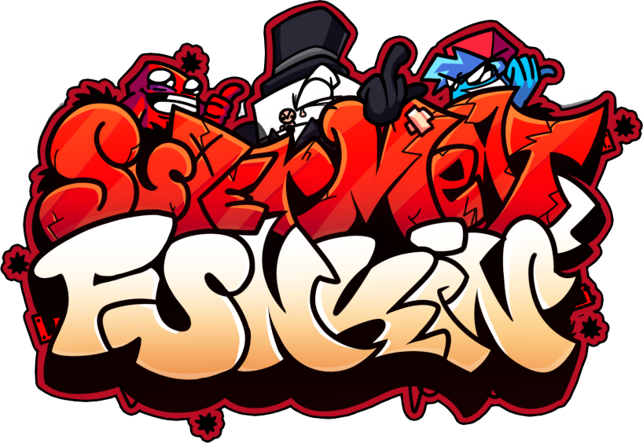

-

# Super Meat Funkin'

## Credits
### Friday Night Funkin'
 - [ninjamuffin99](https://twitter.com/ninja_muffin99) - Programming
 - [PhantomArcade3K](https://twitter.com/phantomarcade3k) and [Evilsk8r](https://twitter.com/evilsk8r) - Art
 - [Kawai Sprite](https://twitter.com/kawaisprite) - Music

This game was made with love to Newgrounds and its community. Extra love to Tom Fulp.
### Original Kade Engine
- [KadeDeveloper](https://twitter.com/KadeDeveloper) - Maintainer and lead programmer
- [The contributors](https://github.com/KadeDev/Kade-Engine/graphs/contributors)

### Kade Engine Legacy
- [Shyllis](https://www.twitter.com/dolpshy) - Main Programmer
- [Goldie_5](https://youtube.com/@goldie-5250) - Programmer
- [Makit](https://youtube.com/@makit8854) - Artist

### Mod Devs
- [Shyllis](https://www.twitter.com/dolpshy) - Main Programmer, Animator, Musician, Charter and Director
- [Makit](https://youtube.com/@makit8854) - Artist and Co-Director
- [Lenya The Cat](https://www.youtube.com/@lenyathecat5112) - Artist
- [Goldie_5](https://youtube.com/@goldie-5250) - Code Help
